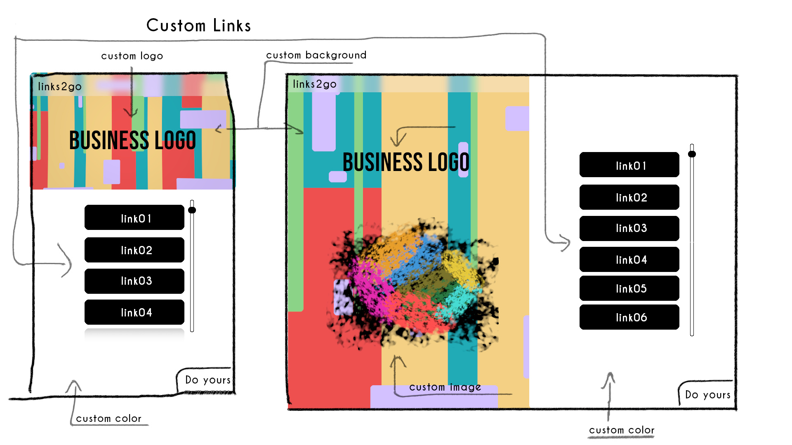
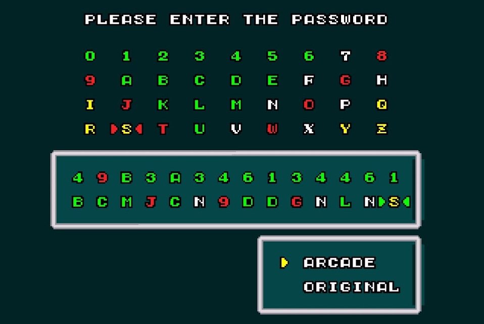
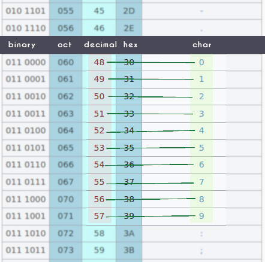
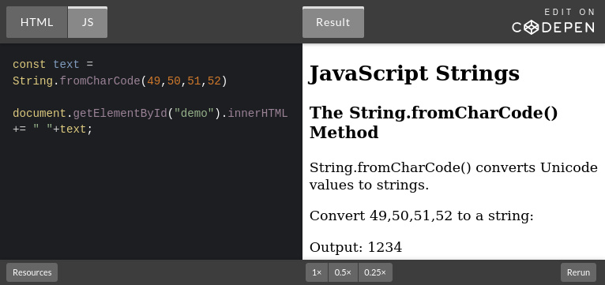

# links 2 go
Is going to be an awesome web app that can make a custom styled link list for social media

- Open source
- Can be Self Hosted
- Will have a free public available hosted app
- Will use third-party sevices to simplify the develpment



# Initial Ideas
The purpose of this project is to build something lik a SAAS from scratch, open to the community - for anyone that can learn from it and for experienced people likely to help.

The idea is to create something focused of whats is really important on the process of building a web project trying to not shine so much light on the things that matters the less.

I'm bulding it for me to learn in the process, and maybe inspire or help people that are not in the level of meking this kind of project by themselves. Yes it,s possible.

# Some interesting notes
There is something curious about this app: Every user will have how many styled pages they want. I'm not holding any user data with this project.

The app works like a page generator that recieves compressed data and do his magick.

There are tho bodies of data that could increase the complexity of this app.

- **Custom Images**

They are easy to store, but are very large in size. Cloud storage is not cheap.
The solution for this problem is allowing ony imageURLs, aka already hosted images. The app will suggest a thirdy-party free image host for a nice user experience.

- **Custom Settings**

The hard party here is handling users, this can be a huge pain when making a software. Handling user is a huge piece of infra structure involving holding users in a secure way on a database and a API server running to handle logins, logouts, sign tokens, etc. Not Cheap, huge code to maintain. (We need to know how to do all these VERY IMPORTANT things in professional products, but its not the point of this project.)

Despite being complex, user settings data tend to be lightweight and in this case its going to be just a page data.

**Inspiration**

Taking advantage fo its little size I've came to an not so new idea, stolen from old console games like Sega Genesis, aka Megadrive. The password concept.

In games like Super Hang On, you would recieve a long Hexa Decimal code that represents the compressed data of your game progress.
\
Eliminating the need for MemoryCards. Of course you would need to save a paper with the long password written ont it. It was kinda cool in that times.
\
To recover your progress you would write the password in and voila, your progess is back were you stoped.

**The Solution**
I can compress lots of urls, titles and CSS data, encoding them using an even higher base them the 16 bits of the Super hangon in the modern world.

I could play with the entire ASCII char spectrum that is 127 as the base. But actually I would need to remove unprintable, unsafe and reseved characters from the list, like listed in [here](https://support.exactonline.com/community/s/knowledge-base#All-All-DNO-Content-urlcharacters), resulting in 75 as the base. It still can holds lots of data!

Well, lots of hours have passed and I've realized that the base is not the main thing that can be used to compress data, at least in this scenario.

Studied a lot about text encoding but ended up with a simpler solution (maybe).

**GZip Compression**
[GZip compression](https://en.wikipedia.org/wiki/Gzip) is the good old fashion way of compressing data. And would fit better in this scenario with different types of data, that I can control only a part of it.

Luckly there is a NPM package that can do this in javascript. It was not easy to use it at first, leading me to abort it. But while studying and working with chars and text encoding my mind clicked up and I found the way through it.

This was harder than I expected, not because of the defficulty of the task but because of the time that I spent making this work. 
But it was very enjoyable.

I was able to srink **5.714** characters data JSON into a **1.662** characters b64 URL safe string.

Gzip compression is intended for files so it will work with raw bytes data.

So if you use Gzip on a simple file. A string in this case
```js
const g = require("gzip-js")
let result = g.zip("123456789")
console.log("ziped file: " + result)
```
```sh
CONSOLE |
-------- 
ziped file: 31,139,8,0,224,124,46,102,0,3,51,52,50,54,49,53,51,183,176,4,0,38,57,244,203,9,0,0,0
```

This is an array of bytes each item is a number from 0 to 255.

Before continuing the line of thoughts there is a interesting thing that I could implement further on this algorith though.
Because GZip is intended for files, it ataches some metadata like timestamp, operating system and more. And I got no time yet to remove just this part of the JS-Gzip code. Both from zip and unzip functions.

This issue results in compressed data that are bigger than the data itself when the input file is small like "123456789"

lets see the unziped data:
```js
const g = require("gzip-js")
const ziped = g.zip("123456789")
let result = g.unzip(ziped)
console.log("unziped file: " + result)
console.log("Length: " + result.length)
```
```sh
CONSOLE |
-------- 
Unziped file: 49,50,51,52,53,54,55,56,57
Length: 9
```
As you can see this array have the same length of the original string.
And each value represent each character on [UTF-8](https://en.wikipedia.org/wiki/UTF-8)/[ASCII](https://en.wikipedia.org/wiki/ASCII) text encoding system\
[**ASCII Table ➡️**](https://en.wikipedia.org/wiki/ASCII#Printable_characters)\
[](https://en.wikipedia.org/wiki/ASCII#Printable_characters)

So for decoding this into the original string, there is a Javascript string prototype method fromCharCode() that can help us with that

[Play in CodePen ➡️](https://codepen.io/flou-ainan/pen/abxxJNK?editors=1010)
[](https://codepen.io/flou-ainan/pen/abxxJNK?editors=1010)

So in my previous example:
```js
const g = require("gzip-js")
const ziped = g.zip("123456789")
let unziped = g.unzip(ziped)
let result = ""
unziped.forEach(charCode => result+= String.fromCharCode(charCode))

console.log("Ziped File: "+ ziped)
console.log("Unziped file: " + unziped)
console.log("Original: " + result)
```
```sh
CONSOLE |
-------- 
Ziped File: 31,139,8,0,110,166,46,102,0,3,51,52,50,54,49,53,51,183,176,4,0,38,57,244,203,9,0,0,0
Unziped file: 49,50,51,52,53,54,55,56,57
Original: 123456789
```
If we compress larger files that is the intention of this code. We can achieve awesome results. Like from **5.714** characters to **1.662** as mentioned before.

### **Base 64 strings**
When implementing the code I realized that using base 75 would be useless unless implementing a very smart and time consuming to build algorithm for more data compression.

The thing that I've made instead was just a data reorganization and simple math to be able to use less space when representing arrays of bytes data.

Usualy when we represent bytes in strings we use hexadecimal code.

The text `1234` when turned into a bytes array become `[49,50,51,52]` and when ziped it will turn into another bytes array as seen before. But for this example we will assume that `[245,50,151,0]`is the ziped result.
as explained before, each item is a byte that is a 0 to 255 value.

We could use only decimal numbers to represent bytes on strings like this. Removing all the commas and square brackets and fixing the number of digits of the values. In this way we can now that at every 3 character we have a byte. 
Example:

```
[245,50,151,0] -> 245050151000

if we slice on trios

24505015100 -> 245 050 151 000

we get the original bytes values
```

Usualy we would use [hexadecimal](https://en.wikipedia.org/wiki/Hexadecimal) values for this text representation because a [byte](https://en.wikipedia.org/wiki/Byte) is essentialy a 8bits set. [Bits](https://en.wikipedia.org/wiki/Bit) are a base 2 number representation. So as base 16 (aka hex) being a multiple of 2 turn the things easier for representing and converting from bases.

### Base 16 strings

HEX digits are:
```
hex      dec
 0   ->   0
 1   ->   1
 2   ->   2
 3   ->   3
 4   ->   4
 5   ->   5
 6   ->   6
 7   ->   7
 8   ->   8
 9   ->   9
 a   ->   10
 b   ->   11
 c   ->   12
 d   ->   13
 e   ->   14
 f   ->   15
```

So with only 2 digits we can represent the 255 possible values of a byte.

See [base conversions](https://math.libretexts.org/Courses/College_of_the_Canyons/Math_130%3A_Math_for_Elementary_School_Teachers_(Lagusker)/02%3A_Empathy_and_Primary_Mathematics/2.06%3A_Converting_Between_(our)_Base_10_and_Any_Other_Base_(and_vice_versa)) if you dont understand next part.

For example: 
**49₁₀ -> hex**
```
49 / 16 = 3 -> 1₁₀ = 1₁₆
3  / 16 = 0 -> 3₁₀ = 3₁₆

49₁₀ = 31₁₆
```

In this case we wouldn't reduce the digits. but we can benefit from values bigger than 99.

**245₁₀ -> hex**
```
245 / 16 = 15 -> 5₁₀  = 5₁₆
15  / 16 = 0  -> 15₁₀ = f₁₆ 

245₁₀ = f5₁₆
```


So we could represent `245 050 151 000` as `f5 32 97 00` or\
`245050151000` as `f5329700`

In the [testing file](./src/testing.js).
```js
  const c = require("./helpers/utils")

  // -- Converting from decimal to hexadecimal --
  let decBytes = [245, 50, 151, 0]
  let hexBytes = decBytes.map(byte => c.toBase(byte, 16))
  console.log("Hex Array: " + hexBytes)
  
  // -- Turning into a string --
  // Fix padding to 2 digits
  hexBytes = hexBytes.map(byte=>byte.padStart(2,"0"))
  console.log("Padded Hex Array: " + hexBytes)
  // Join
  let HexBytesString = hexBytes.join("")
  console.log("Hex String: " + HexBytesString)
```
```sh
CONSOLE |
-------- 
Hex Array: f5,32,97,0
Padded Hex Array: f5,32,97,00
Hex String: f5329700
```
<small>You should not iterate 2 times, and pad while converting instead, its just separated for clarification</small>

Its important to fix the padding, otherwise we would loose the way back conversion. Because as we dont have separation chars, we need to slice on pairs.

In a example if you dont fix the number of digits when converting `[12,0,240]`
the result would be:
```
12 = b | 0 = 0 | 240 = f0
-> b0f0
```
If we slice it on pairs `b0 f0` when converting back it would result `[176, 240]` a data corruption.

**Converting Back**
```js
  let HexBytesString = "f5329700"
  let result = c.hexToBytesArray(HexBytesString)
  console.log(result)
```
```
CONSOLE | 
-------- 
[ 245, 50, 151, 0 ]
```
**hexToBytesArray** function from [utils script](./src/helpers/utils.js)
```js
// takes a hex string and return a bytes array
exports.hexToBytesArray = (hexString) =>{
    let result = ""
    const separator = " "
    // separate hex string on pairs
    for(let i=0; i < hexString.length; i+=2 ){
        result += hexString.slice(i,i+2) + separator
    }
    // removes useless separator in the end
    result = result.slice(0,-1)
    // turn string into array of hex bytes
    result = result.split(" ")
    //converts back each hex byte to decimal
    result = result.map(hexByte => this.fromBase(hexByte, 16))
    return result
}
```


